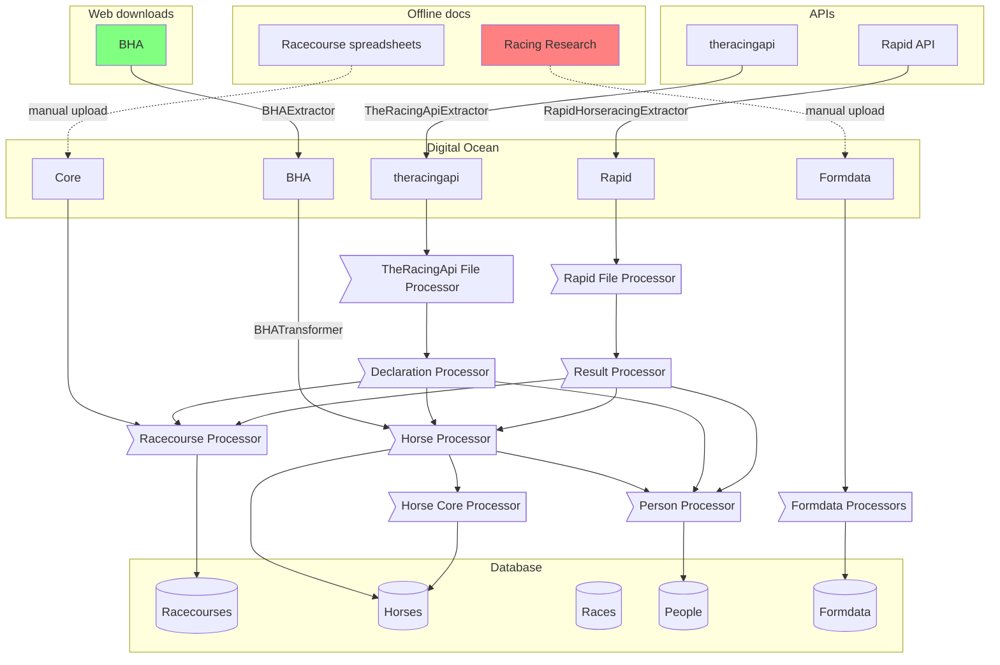

```mermaid
flowchart TB
    subgraph Web downloads
        S1[BHA]
    end
    subgraph APIs
        S2[Rapid API]
        S3[theracingapi]
    end
    subgraph Offline docs
        S4[Racing Research]
        S5[Racecourse spreadsheets]
    end
    subgraph Digital Ocean
        F1[BHA]
        F2[Core]
        F3[Formdata]
        F4[Rapid]
        F5[theracingapi]
    end
    subgraph Database
        D1[(Racecourses)]
        D2[(Horses)]
        D3[(Races)]
        D4[(People)]
        D5[(Formdata)]
    end
    P1>Formdata Processors]
    P2>Horse Processor]
    P3>Horse Core Processor]
    P4>Person Processor]
    P5>Declaration Processor]
    P6>Result Processor]
    P7>Racecourse Processor]
    P8>Rapid File Processor]
    P9>TheRacingApi File Processor]
    S1 --> |BHAExtractor| F1
    S2 --> |RapidHorseracingExtractor| F4
    S3 --> |TheRacingApiExtractor| F5
    S4 -.manual upload.->F3
    S5 -.manual upload.->F2
    F1 --> |BHATransformer| P2
    F2 --> P7
    F3 --> P1
    P1 --> D5
    P2 --> D2
    P2 --> P3
    P2 --> P4
    P3 --> D2
    P4 --> D4
    P5 --> P7
    P5 --> P2
    P5 --> P4
    P6 --> P7
    P6 --> P2
    P6 --> P4
    P7 --> D1
    P8 --> P6
    P9 --> P5
    F4 --> P8
    F5 --> P9
    style S1 fill:#80ff80
    style S4 fill:#ff8080
```
